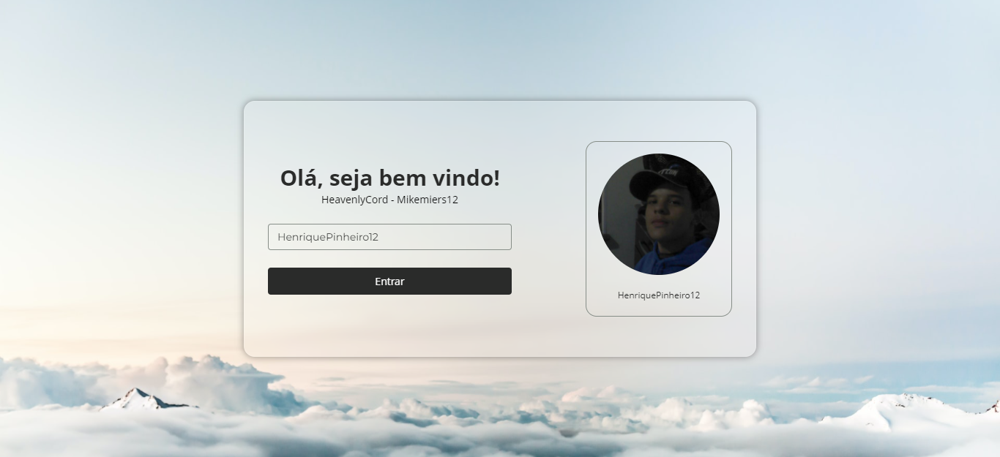
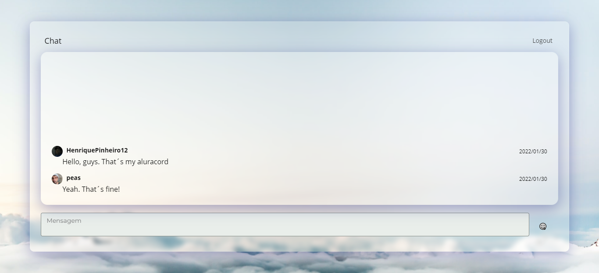

# Aluracord - Imersão_React

Projeto realizado durante a 4º @imersao_react da @alura!

- [Live site](https://aluracord-dusky.vercel.app/)

## Screenshots

## What I learned

- [X] TODO

## Features adcionadas
- CSS Vars globais

Neste projeto, adcionei a funcionalidade de poder configurar o config.json com todas as variáveis globais do css que serão importadas no :root do component de estilos glovais. Desta forma posso usar minhas variáveis nas propriedades dos meus componente e modificá-las apenas no config.json

Feature disponível em __pages/globalstyle.js__